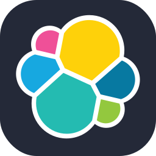

# Hi, I'm [Jaish Khan](https://maybejaishkhan.github.io)

```kt
class JaishKhan: StudentForever {
	val university = "University of Sindh, Jamshoro, Pakistan"
	val discipline = "Bachelor's of Information Technology"
}

fun JaishKhan.hobbies {
	return ["Programming", "Anime", "Chess", "ReadingThrough500PagesOfDocumentationCuzWhyNot"]
}

fun JaishKhan.newfound-hobbies {
  return ["Home-Labbing", "Automating-Everything"]
}
```

## Learning with Documentation

Documentation is that **ONE** thing that has made a whole lot of difference in me not being able to retain things I've learned... to now confidently exploring new things without the fear of amnesia.

  

[Obsidian](https://obsidian.md/) + [Markdown](https://www.markdownguide.org/) + [Latex](https://www.latex-project.org/get/) is ofcourse **objectively** the best and most productive way (yes I'm right).

## My DevOps TechStack + Skillset 🛠️

<table>
<tr>
  <td valign="top" width="50%">

### Absolute Fundamentals

> Core Fundamentals like **DevOps Principles**, **Programming**, **Operating Systems**, **Version Control**, **Containers** and **Virtual Machines**.

<p align="center">
  <kbd> &nbsp; Linux
  </kbd>
  <span style="display: inline-block; border: 1px solid #ccc; border-radius: 8px; padding: 4px 8px; margin: 4px;">
  
  Windows
  </span>
</p>


<p align="center">
  
  
  
  
  
  
  
  
</p>

  </td>
</tr>
<tr>
  <td valign="top">

### Automation and CI/CD

> Continuous Integration, Config Management and Full Automation.

<p align="center">
  
  
  
  
  
  
  
  
</p>

  </td>
</tr>
<tr>
  <td valign="top">

### Cloud and Infrastructure

> Cloud Providers, Container Orchestration, Provisioning and Management.

<p align="center">
  
  
    
  
  
  
  
  
</p>

  </td>
</tr>
<tr>
  <td valign="top">

### Monitoring and Observability

> Metrics, Logs, Traces, Dashboards + Message Queues.

<p align="center">
  
  
    
  
  
  
  
  
</p>

  </td>
</tr>
</table>

<details>
  <summary><h3>Other Skills</h3></summary>

### 🌐 WebDev

Most familiar with it and have created many, many websites/apps.

<p align="center">
	

  </td>

<td valign="top" width="50%">

### 📱 AndroidDev

I find it the most friction-less and fruitful to work with.

<p align="center">
	

  </td>
</details>

## My Github Stats

[](https://github.com/maybejaishkhan/github-readme-stats)

<details>
  <summary>My Developer Mantra 😇</summary>

  *"Embrace the bugs, cherish the commits, and always remember: even semicolons deserve a second chance."*
  
</details>

<kbd>
  
  JavaScript
</kbd>

